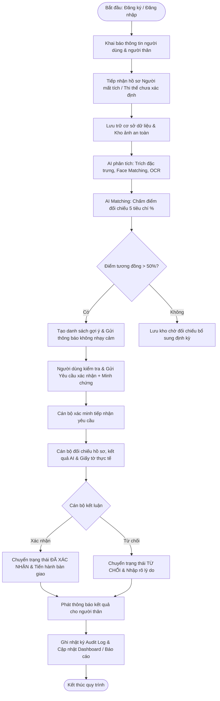

# Hệ Thống Quản Lý Thi Thể Và Xác Minh Danh Tính
(Body Management and Identity Verification System)

---

## 📌 1. Giới thiệu tổng quan

Hệ thống Quản lý Thi thể và Xác minh Danh tính là giải pháp công nghệ thông tin tích hợp Trí tuệ Nhân tạo (AI), hỗ trợ cơ quan chức năng, cán bộ chuyên trách và thân nhân trong việc tiếp nhận, quản lý thông tin, tìm kiếm, đối chiếu và thẩm tra xác minh danh tính các trường hợp tử thi chưa rõ danh tính và người mất tích.

> [!IMPORTANT]
> **Nguyên tắc cốt lõi của hệ thống:**
> Kết quả do hệ thống AI tính toán chỉ mang tính chất **đề xuất / gợi ý xác suất trùng khớp (%)**, hoàn toàn **không tự động kết luận danh tính**. Quyết định công nhận danh tính cuối cùng luôn thuộc về **Cán bộ có thẩm quyền** sau khi đã kiểm tra thực tế, đối chiếu giấy tờ pháp lý và minh chứng nhân thân.

---

## 👥 2. Phạm vi về đối tượng sử dụng (Actors)

Hệ thống phục vụ 3 nhóm đối tượng chính:

1. **Admin (Quản trị viên hệ thống):**
   - Quản trị toàn diện hệ thống: quản lý tài khoản người dùng và cán bộ, phân quyền vai trò (RBAC).
   - Quản lý danh mục hồ sơ hệ thống (xem, sửa, khóa/hủy theo thẩm quyền).
   - Theo dõi Dashboard điều hành, xem thống kê đa chiều theo thời gian, địa bàn, trạng thái.
   - Xuất báo cáo tổng hợp (PDF, Excel).
   - Giám sát nhật ký hoạt động (Audit Logs) và an toàn bảo mật hệ thống.

2. **Cán bộ xác minh (Công an / Cán bộ chuyên trách):**
   - Tiếp nhận hồ sơ người mất tích và hồ sơ tử thi chưa xác định danh tính.
   - Quản lý thông tin vụ việc, vật phẩm/tư trang kèm theo thi thể.
   - Tra cứu, đối chiếu hồ sơ; theo dõi và đánh giá kết quả phân tích, gợi ý trùng khớp từ AI.
   - Thẩm tra hồ sơ, kiểm tra minh chứng nhân thân thực tế từ thân nhân gửi lên.
   - Phê duyệt: Đưa ra kết luận chính thức **Xác nhận** hoặc **Từ chối** (kèm lý do).
   - Cập nhật tiến trình vụ việc và kích hoạt thông báo tiến độ.

3. **User / Người thân:**
   - Đăng ký và quản lý tài khoản cá nhân, xác minh thông tin liên hệ.
   - Quản lý danh sách người thân, khai báo thông tin nhân thân.
   - Đăng ký tìm người mất tích (cung cấp đặc điểm nhân dạng, hoàn cảnh mất tích, tải ảnh).
   - Tìm kiếm, tra cứu hồ sơ (bao gồm tìm kiếm nâng cao và tìm kiếm bằng hình ảnh).
   - Gửi yêu cầu xác nhận khi phát hiện hồ sơ nghi trùng (kèm tải minh chứng quan hệ).
   - Theo dõi tiến trình xử lý yêu cầu theo thời gian thực.
   - Nhận thông báo tự động khi có hồ sơ nghi trùng hoặc có cập nhật kết quả xác minh.

---

## 💼 3. Phạm vi về nghiệp vụ (Chức năng chính)

1. **Quản lý hồ sơ:**
   - Hồ sơ người mất tích (`HoSoNguoiMatTich`).
   - Hồ sơ chưa xác định danh tính / thi thể tiếp nhận (`HoSoChuaXacDinh`).
   - Hồ sơ người đã xác định danh tính (`HoSoNguoiDaXacDinh`).
2. **Đăng ký tìm người thân:**
   - Tiếp nhận thông tin cơ bản, đặc điểm nhận dạng, hoàn cảnh vụ việc mất tích và tệp hình ảnh đính kèm.
3. **Đối chiếu / Tìm kiếm hồ sơ trùng khớp:**
   - Thuật toán chấm điểm matching đa tiêu chí, tính tỷ lệ phần trăm tương đồng (%).
4. **Quy trình "Nhận người thân" (Xác minh danh tính):**
   - Luồng nghiệp vụ nghiêm ngặt: Gửi yêu cầu $\to$ Đang xác minh $\to$ Yêu cầu bổ sung (nếu cần) $\to$ Đã xác nhận / Từ chối $\to$ Hoàn tất bàn giao.
5. **Thông báo tự động:**
   - Phát cảnh báo tự động khi có hồ sơ nghi trùng khớp hoặc thay đổi trạng thái vụ việc qua ứng dụng/email/SMS.
6. **Tra cứu, tìm kiếm nâng cao:**
   - Lọc theo địa bàn, độ tuổi, dấu vết nhận dạng và tìm kiếm trực quan bằng hình ảnh (Face Matching).
7. **Thống kê, dashboard, báo cáo:**
   - Biểu đồ trực quan hóa dữ liệu, trích xuất báo cáo chuyên đề định dạng PDF/Excel.

---

## 🧠 4. Phạm vi về AI (Trọng tâm kỹ thuật)

Phân hệ AI được module hóa độc lập gồm 4 khối nghiệp vụ chính:

```
                  ┌────────────────────────────────────────┐
                  │             AI Core Engine             │
                  └───────────────────┬────────────────────┘
          ┌─────────────────┬─────────┴─────────┬──────────────────┐
          ▼                 ▼                   ▼                  ▼
┌──────────────────┐┌────────────────┐┌──────────────────┐┌──────────────────┐
│ Module 1:        ││ Module 2:      ││ Module 3:        ││ Module 4:        │
│ Nhận diện        ││ Phân tích ảnh  ││ So khớp hình ảnh ││ AI Matching      │
│ Biển số xe       ││                ││                  ││ Hồ sơ (Trọng tâm)│
│ (OCR biển số)    ││ (Người, xe,    ││ (Face Matching   ││ (Chấm điểm tổng  │
│                  ││  đặc điểm)     ││  vector)         ││  hợp 5 tiêu chí) │
└──────────────────┘└────────────────┘└──────────────────┘└──────────────────┘
```

1. **Module 1 - Nhận diện biển số xe (License Plate OCR):**
   - Trích xuất ảnh hiện trường/tai nạn $\to$ phát hiện và nhận dạng ký tự biển số $\to$ hỗ trợ tra cứu thông tin chủ xe phục vụ điều tra.
2. **Module 2 - Phân tích ảnh (Visual Analysis):**
   - Phát hiện đối tượng người, phương tiện, trang phục, dị tật, hình xăm, vết sẹo hoặc đặc điểm nhận dạng riêng biệt.
3. **Module 3 - So khớp hình ảnh (Face Recognition & Matching):**
   - Trích xuất vector đặc trưng khuôn mặt (Embeddings) từ ảnh người mất tích và ảnh thi thể, tính khoảng cách tương đồng cosine/euclidean.
4. **Module 4 - AI Matching hồ sơ (Module trọng tâm nhất):**
   - Đối chiếu chéo dữ liệu thông tin người dùng khai báo với Cơ sở dữ liệu hồ sơ theo trọng số tiêu chuẩn:

| Tiêu chí đối chiếu | Tỷ trọng điểm | Mô tả |
| :--- | :---: | :--- |
| **Thông tin cá nhân** | **30%** | Họ tên, năm sinh/độ tuổi, giới tính, quê quán/địa chỉ |
| **Hình ảnh** | **25%** | Điểm số độ tương đồng khuôn mặt từ Module 3 |
| **Đặc điểm nhận dạng** | **20%** | Vết sẹo, nốt ruồi, hình xăm, dị tật, chiều cao, màu tóc |
| **Địa điểm** | **15%** | Nơi mất tích vs. Nơi phát hiện tử thi |
| **Thời gian** | **10%** | Thời điểm mất tích vs. Thời điểm phát hiện / thời gian tử vong ước tính |
| **TỔNG CỘNG** | **100%** | Điểm tổng hợp tương đồng (%) |

### Phân cấp ngưỡng xử lý đề xuất:
- **> 50%:** Xếp loại **Có khả năng** trùng khớp $\to$ đưa vào danh sách theo dõi.
- **> 75%:** Xếp loại **Cần xác minh** $\to$ gửi gợi ý cho cán bộ và thông báo nhắc người thân.
- **> 90%:** Xếp loại **Ưu tiên xác minh** $\to$ đẩy lên đầu hàng đợi xử lý khẩn của cán bộ chuyên trách.

---

## 🔒 5. Giới hạn & Nguyên tắc quan trọng

1. **Tính chất đề xuất:** AI chỉ đưa ra điểm số xác suất (%), không có thẩm quyền kết luận danh tính. Quyết định xác nhận hay từ chối luôn thuộc thẩm quyền con người (Cán bộ xác minh).
2. **Bảo mật & Tôn trọng quyền riêng tư:**
   - Hình ảnh thi thể và các chi tiết khám nghiệm nhạy cảm **tuyệt đối không gửi trực tiếp hay hiển thị công khai** cho người dùng thông thường.
   - Khi có cảnh báo nghi trùng, thông báo gửi cho người thân chỉ hiển thị mã hồ sơ gợi ý và hướng dẫn thủ tục liên hệ xác minh.
3. **Phạm vi cấu trúc:** Hệ thống tập trung vào công tác quản lý hồ sơ, truy nguyên danh tính và bàn giao thân nhân; **đã loại bỏ phân hệ "Nhà tang lễ"** khỏi cấu trúc nghiệp vụ.

---

## 🗄️ 6. Phạm vi về Dữ liệu (Các thực thể cốt lõi)

Cơ sở dữ liệu hệ thống được thiết kế chuẩn hóa quanh các thực thể chính:

1. `TaiKhoan` (Account): Quản lý đăng nhập, mật khẩu băm, trạng thái khóa, thời điểm truy cập.
2. `NguoiDung` (User): Thông tin hồ sơ người dùng trong hệ thống.
3. `NguoiThan` (Relative): Thông tin người thân do người dùng khai báo (họ tên, CCCD, quan hệ...).
4. `CanBo` (Officer): Thông tin cán bộ xác minh, chức vụ, đơn vị công tác, thẩm quyền.
5. `HoSoNguoiMatTich` (Missing Person Record): Hồ sơ chi tiết về người mất tích.
6. `HoSoChuaXacDinh` (Unidentified Body Record): Hồ sơ thi thể tiếp nhận chưa rõ danh tính.
7. `HoSoNguoiDaXacDinh` (Identified Record): Hồ sơ sau khi đã có quyết định xác minh danh tính chính thức.
8. `VuViec` (Case/Incident): Thông tin vụ việc, hiện trường, địa điểm, thời gian phát hiện.
9. `HinhAnh` (Image): Quản lý tệp ảnh (ảnh người mất tích, ảnh thi thể, ảnh hiện trường, giấy tờ).
10. `KetQuaAI` (AI Result): Kết quả trích xuất đặc trưng, nhận diện khuôn mặt, OCR biển số.
11. `AI_Matching` (AI Matching Record): Bản ghi điểm số tương đồng giữa cặp hồ sơ và phân rã điểm thành phần.
12. `YeuCauXacNhan` (Verification Request): Đơn yêu cầu nhận người thân do người dùng gửi kèm minh chứng.
13. `ThongBao` (Notification): Lịch sử và nội dung thông báo gửi đến các chủ thể.
14. `NhatKyHeThong` (Audit Log): Ghi vết toàn bộ hành vi đăng nhập, truy cập, chỉnh sửa, phê duyệt.

---

## 📋 7. Danh mục Use Case (UC01 - UC19)

| Nhóm | Mã UC | Tên Use Case | Actor chính | Actor phụ |
| :--- | :--- | :--- | :--- | :--- |
| **Tài khoản & Thông tin cá nhân** | `UC01` | Đăng ký / Đăng nhập | Người dùng, Cán bộ, Admin | - |
| | `UC02` | Quản lý người thân | Người dùng | - |
| | `UC03` | Cập nhật thông tin cá nhân | Người dùng | - |
| **Tìm kiếm & Yêu cầu xác nhận** | `UC04` | Tìm kiếm người thân | Người dùng | Hệ thống AI, Thông báo |
| | `UC05` | Tìm kiếm hình ảnh (So khớp ảnh) | Người dùng | Hệ thống AI |
| | `UC06` | Yêu cầu xác nhận nhân thân | Người dùng | Hệ thống thông báo |
| | `UC07` | Theo dõi trạng thái yêu cầu | Người dùng | - |
| **Nghiệp vụ xác minh & Xử lý** | `UC08` | Tiếp nhận hồ sơ (Mất tích / Tử thi) | Cán bộ xác minh | Hệ thống AI |
| | `UC09` | Xem kết quả phân tích AI | Cán bộ xác minh | Hệ thống AI |
| | `UC10` | Thẩm tra & Xác minh hồ sơ | Cán bộ xác minh | - |
| | `UC11` | Xác nhận / Từ chối kết luận | Cán bộ xác minh | - |
| | `UC12` | Cập nhật trạng thái vụ việc | Cán bộ xác minh | Hệ thống thông báo |
| **Quản trị hệ thống & Báo cáo** | `UC13` | Quản lý tài khoản & Phân quyền | Admin | - |
| | `UC14` | Quản trị danh mục hồ sơ | Admin | - |
| | `UC15` | Xem dashboard & Xuất báo cáo | Admin | - |
| | `UC16` | Xem nhật ký hoạt động (Audit Logs) | Admin | - |
| **Xử lý tự động (AI & Thông báo)**| `UC17` | AI Matching đối chiếu hồ sơ | Hệ thống AI | - |
| | `UC18` | Phân tích trích xuất & So khớp ảnh | Hệ thống AI | - |
| | `UC19` | Phát sinh & Gửi thông báo tự động | Hệ thống thông báo | - |

---

## 🔄 8. Quy trình nghiệp vụ tổng thể



### Vòng đời trạng thái Yêu cầu xác nhận:
$$\text{Đã gửi} \longrightarrow \text{Đang xác minh} \longrightarrow \begin{cases} \text{Yêu cầu bổ sung (nếu thiếu)} \longrightarrow \text{Đang xác minh} \\ \text{Đã xác nhận} \longrightarrow \text{Hoàn tất bàn giao} \\ \text{Từ chối (kèm lý do)} \longrightarrow \text{Đóng hồ sơ} \end{cases}$$

---

## 📁 9. Cấu trúc thư mục dự án

```
He-thong-quan-ly-thi-the-va-xac-minh-danh-tinh/
│
├── .github/                      # CI/CD Workflows
│   └── workflows/build.yml
│
├── backend/                      # Backend .NET Core Web API
│   ├── DeathManagement.sln
│   └── src/DeathManagement.API/  # Controllers, Services, Repositories, Entities, DTOs
│
├── frontend/                     # Frontend React + TypeScript + Vite
│   ├── src/                      # Layouts, Pages, Features, Services, Hooks, Routes
│   └── package.json
│
├── ai-service/                   # Microservice AI Python (FastAPI)
│   ├── app/                      # Face matching, OCR, Image enhancement
│   └── requirements.txt
│
├── database/                     # Scripts khởi tạo & di chuyển CSDL (01 -> 09)
│
├── docs/                         # Hồ sơ tài liệu thiết kế hệ thống
│   ├── requirements/             # Đặc tả yêu cầu chức năng & phi chức năng
│   ├── use-case/                 # Đặc tả chi tiết từng Use Case (UC01 - UC19)
│   ├── architecture/             # Sơ đồ kiến trúc hệ thống
│   └── api/                      # Tài liệu Swagger / RESTful API
│
├── tests/                        # Kiểm thử đơn vị, giao diện và tích hợp
│
├── docker-compose.yml            # Khởi chạy toàn bộ hệ thống bằng Docker
└── README.md                     # Tài liệu hướng dẫn tổng quan dự án
```
